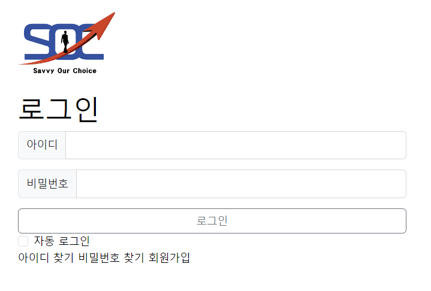
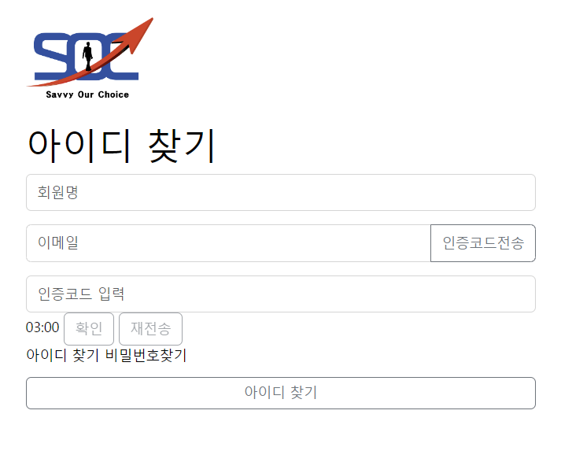

# 📈주식, 코인 커뮤니티 풀랫폼 (SOC 'Savvy Our Choice')

## 🌞프로잭트 개요
### 📢프로젝트 소개
- **프로잭트명 :** SOC 'Savvy Our Choice'
- **개발 배경 및 목적**
  - 사람들의 안전하고 건전한 투자생활을 지향하고 정보를 공유할 수 있고 다른 사람의 의견을 알기 위한 커뮤니티를 만든다.
  - 처음 투자를 하는 사람들, 혼자 투자를 하는 사람들이 좀 더 유대감을 느끼면서 투자를 하길 바라는 마음에 만든다.
- **기대효과 및 활용분야**
  - 개개인의 차트분석법을 공유할 수 있고 타 서비스보다 신뢰성이 있는 정보로 투기가 아닌 투자를 하는 방법을 터득할 수 있다.
  - 처음 투자를 시작하는 사람들의 진입장벽을 낮춰 보다 빠르게 나만의 차트 분석법을 습득할 수 있다.

### 🧑‍💻개발자소개

- 개발인원 : 5명
- 개발자 : 김현교, 김혜정, 이기흥, 이다은, 이지은

### 🗓️개발기간

- 2023.12.26(화요일) ~ 2024.01.31(수요일)

## 💻개발환경 ⚙️기술스텍

## 🖇️UesrFlow

## 📋ERD

## 🎥시연영상

<!-- <iframe width="1044" height="587" src="https://youtu.be/2ZI5ST2YZhU?si=LER77efcT0tc6NRt" frameborder="0" allow="accelerometer; autoplay; encrypted-media; gyroscope; picture-in-picture" allowfullscreen></iframe> -->

## 📑기능명세

🔎미리보기

| 회원가입 | 로그인 | 회원정보찾기 |
|------|-----|-------|
||||

| 프로필 (회원정보수정)    | 팔로우                      | 회원탈퇴                       |
|---------------------|--------------------------|----------------------------|
|  |  |  |

| 차트 | 최근게시글                       | 게시판                     |
|----|-----------------------------|-------------------------|
|    |  |  |

| 게시글검색 | 내활동                      | 관리자                      |
|-------|--------------------------|--------------------------|
|       |  |  |

---

### ▶️ 관리자

#### 📖 기본설정

- 사이트설정 (제목, 설명, 키워드)
- 썸네일 이미지 설정
- 약관 설정

#### 📖 회원관리

- 회원 조회
- 회원 등록
- 회원 정보 수정
- 회원 탈퇴
- 회원 권한 설정

#### 📖 게시판관리

- 게시판 조회
- 게시판 등록
   - 기본설정 : 게시판 ID, 이름, 페이지관련기능, 세부기능 설정
   - 카테고리 분류
   - 접근권한 설정
- 게시판 수정 및 삭제
- 게시판 사용여부 설정
- 게시글 관리

#### 📖 보조지표관리

- 보조지표 조회
- 보조지표 등록
- 보조지표 수정/ 삭제
- 보조지표 사용여부 설정
- 보조지표 랭킹 관리

---

### ▶️ 회원

#### 📖 회원가입

- 권한
   - 가입시 일반회원(USER)
   - USER/ MANAGER/ ADMIN
- ID : 영문과 숫자 조합으로 6자리 이상 제한, 중복 여부 확인
- PW
   - 영문, 대소문자, 숫자, 특문 조합으로 8자리 이상 제한
   - 비밀번호는 암호화(hashing) 과정을 거쳐 DB에 저장
- 회원명 : 공백 입력 제한, 중복 여부 확인
- E-mail : 이메일인증 필수, 인증코드 발송 및 일치여부 확인
- 보조지표 : 사용하는 만큼 선택 가능
- 약관 동의 : 체크박스 클릭 필수

#### 📖 로그인

- ID/ PW로 로그인 가능
- ID찾기
   - 회원명, 이메일 인증을 통해 찾기 가능
- PW찾기
   - ID, 이메일 확인 -> 이메일로 임시 비밀번호 전송

#### 📖 마이페이지

- 내프로필
   - 회원정보 수정 : 닉네임, 비밀번호, 이메일, 보조지표, 대표이미지
- 내활동
   - 본인작성한 게시글, 코멘트 조회
   - 찜 게시글
   - 최근 본 게시글
- 회원탈퇴
   -  비밀번호 확인 -> 이메일로 인증코드 전송 -> 인증코드 확인 후 탈퇴
- 팔로우
   - follower/ following 조회
   - 유저선택 -> 유저페이지로 이동

#### 📖 유저페이지

- 유저 정보 확인
- 유저 작성 게시글

---

### ▶️ 게시판

#### 📖 게시판 구분

- 기본게시판 : 공지사항, 팁과 노하우, Q & A
- 자유게시판 : MANAGER 등급의 회원이 원하는 커뮤니티 게시판 생성 가능

#### 📖 게시글 구성

- 제목, 작성자, 조회수, IP, 작성일자, 작성내용
- 작성자 : Follow/UnFollow 버튼
- 찜버튼
- 권한에 따른 글쓰기, 수정, 삭제, 답글, 목록
- 댓들 작성 및 목록

#### 📖 게시글 작성

- 카테고리 분류
- 제목, 내용 입력
- 이미지, 파일 업로드

#### 📖 게시글 검색

- 제목, 내용, 제목+내용, 작성자 기준으로 검색

---

### ▶️ 보조지표 랭킹

- 회원가입시 선택되는 보조지표로 랭킹 결정
- 보조지표 선택 -> 보조지표 게시판으로 이동
   - 댓글 작성

